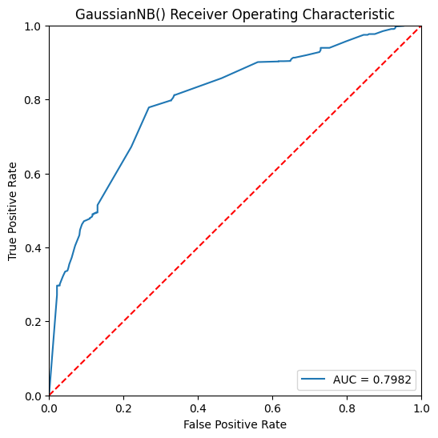
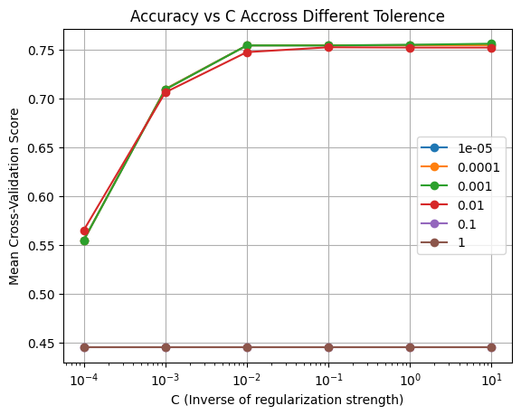
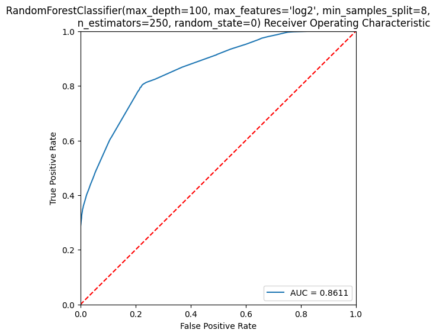

# Mushroomology 101: Introduction to Mushrooms

---

## Problem Definition & Justification

For many people, foraging for mushrooms is a dangerous task. While some mushrooms are absolutely delicious like the Shiitake mushrooms, others can be poisonous or even deadly, such as the Death Cap Mushrooms. As more and more people cherish a healthy lifestyle of eating organic foods, mushroom-picking will undoubtedly be on a rising trend. Therefore, it is crucial to know which mushrooms are safe for consumption, and which mushrooms are harmful. Identifying the differences based on visual features like colour, cap shape, gill attachment, or habitat can be extremely challenging without guidance. 

The dataset we chose for our project includes various mushroom features such as cap shape, surface texture, gill attachment, stem height, and habitat. Our project aims to develop a classification model that can assist inexperienced foragers in making informed decisions on determining whether a mushroom is edible or not. Such a model could serve as a useful tool for foragers, mycologists, and even food safety researchers, helping to demystify mushroom identification, reducing the risk of accidental poisoning.

The selected mushroom dataset is a real world dataset containing over 60000 samples, satisfying the requirement for a dataset with at least 1,000 samples. It also includes 20 features that cover a diverse range of categorical (habitat, colour) and numerical variables (cap diameter, stem height). In addition, the dataset includes a target variable: Class, which is a binary variable with two possible values: `e` (edible) or `p` (poisonous). `Class` is a target variable because every other feature can be used as a predictor to a mushroom`s edibility. 

---

## Project Requirments

### **Dataset Selection**

Dataset Source: [Mushroom Dataset](https://archive.ics.uci.edu/dataset/848/secondary+mushroom+dataset), Using secondary\_data.csv

All attributes & their possible values:

| Attribute | Type | Description | Values |
| ----- | ----- | ----- | ----- |
| `cap-diameter` | Numerical | Cap diameter in cm | Float number in cm |
| `cap-shape` | Categorical | Shape of the cap | Bell \= b, Conical \= c, Convex \= x, Flat \= f, Sunken \= s, Spherical \= p, Others \= o |
| `cap-surface` | Categorical | Surface texture of the cap | Fibrous \= i, Grooves \= g, Scaly \= y, Smooth \= s, Shiny \= h, Leathery \= l, Silky \= k, Sticky \= t, Wrinkled \= w, Fleshy \= e |
| `cap-color` | Categorical | Color of the cap | Brown \= n, Buff \= b, Gray \= g, Green \= r, Pink \= p, Purple \= u, Red \= e, White \= w, Yellow \= y, Blue \= l, Orange \= o, Black \= k |
| `does-bruise-bleed` | Categorical | Whether the mushroom bruises/bleeds | Bruises or Bleeding \= t, No \= f |
| `gill-attachment` | Categorical | Attachment type of the gills | Adnate \= a, Adnexed \= x, Decurrent \= d, Free \= e, Sinuate \= s, Pores \= p, None \= f, Unknown \= ? |
| `gill-spacing` | Categorical | Spacing between the gills | Close \= c, Distant \= d, None \= f |
| `gill-color` | Categorical | Color of the gills | See cap-color \+ None \= f |
| `stem-height` | Numerical | Height of the stem in cm | Float number in cm |
| `stem-width` | Numerical | Width of the stem in mm | Float number in mm |
| `stem-root` | Categorical | Type of stem root | Bulbous \= b, Swollen \= s, Club \= c, Cup \= u, Equal \= e, Rhizomorphs \= z, Rooted \= r |
| `stem-surface` | Categorical | Surface texture of the stem | See cap-surface \+ None \= f |
| `stem-color` | Categorical | Color of the stem | See cap-color \+ None \= f |
| `veil-type` | Categorical | Type of the veil | Partial \= p, Universal \= u |
| `veil-color` | Categorical | Color of the veil | See cap-color \+ None \= f |
| `has-ring` | Categorical | Presence of a ring | Ring \= t, None \= f |
| `ring-type` | Categorical | Type of ring | Cobwebby \= c, Evanescent \= e, Flaring \= r, Grooved \= g, Large \= l, Pendant \= p, Sheathing \= s, Zone \= z, Scaly \= y, Movable \= m, None \= f, Unknown \= ? |
| `spore-print-color` | Categorical | Color of the spore print | See cap-color |
| `habitat` | Categorical | Habitat of the mushroom | Grasses \= g, Leaves \= l, Meadows \= m, Paths \= p, Heaths \= h, Urban \= u, Waste \= w, Woods \= d |
| `season` | Categorical | Season when the mushroom grows | Spring \= s, Summer \= u, Autumn \= a, Winter \= w |
| `class` | Binary | Edibility of the mushroom | Edible \= e, Poisonous \= p (includes unknown edibility) |

### **Exploratory Data Analysis**

In this stage, we examine the dataset using various techniques to draw valuable insights into each feature and how they correlate with each other. These insights will provide information on how to clean the data and potential challenges we may face with it.

* We used the **.info() Function** from pandas to generate a summary of the dataset, including data types and Non-Null counts.  
.png)
* We used the **.describe() Function** from pandas to generate a summary of statistics (e.g., count, mean, standard deviation, minimum, 25th Percentile, 50th Percentile, 75th Percentile, and maximum) for numerical attributes.  
.png)
* Initial outliers are discovered using Z-score and IQR. This demonstrates a small fractions of the dataset contains outliers.

| Attribute | Z-score |  |  | IQR |  |  |
| :---: | :---: | :---: | :---: | :---: | :---: | :---: |
|  | Count  | LB | UB | Count  | LB | UB |
| cap-diameter | 521 | N/A | 22.53 | 2400 | N/A | 16.13 |
| stem-height | 1254 | N/A | 16.69 | 3169 | N/A | 12.39 |
| stem-width | 857 | N/A | 42.26 | 1967 | N/A | 33.61 |

* We also used the following visualization methods:  
  * **Histograms**: Show the frequency of all values for all features.  
  
  * **Boxplots**: Display value distributions for the three numerical features.
    
  * **Heatmaps**: Highlight correlations between the three numerical attributes and the categorical features. We notice that stem-width and cap-diameter have medium to high correlation, which makes sense due to both being in relation to the overall size of the mushroom.  

  
  

* In the end, we obtain the following key insights for each attribute:  
  * `class`: The dataset contains more **poisonous (p)** mushrooms than **edible (e)** ones.  
  * `cap-diameter`: Most mushrooms have small cap diameters (below 10 cm), with a long tail of larger caps.  
  * `cap-shape`: **Convex (x)** is the most common cap shape. Rare shapes include **sunken (s)** and **conical (c)**.  
  * `cap-surface`: **Scaly (y)** and **smooth (s)** surfaces are the most common. Rare surfaces include **leathery (l)** and **silky (k)**.  
  * `cap-colour`: **Brown (n)** is the most common cap color, followed by **gray (g)** and **white (w)**.  
  * `does-bruise-bleed`: Most mushrooms do not bruise or bleed (f), this a potentially usable distinguishing feature.  
  * `gill-attachment & gill-spacing`: **Free gill attachment (e)** is the most common type. Gill spacing is heavily skewed, with **close (c)** spacing dominating.  
  * `gill-color`: The most frequent gill colors are **white (w)** and **brown (n)**, consistent with cap color trends.  
  * `stem-height & stem-width`: Both features are right-skewed, with most mushrooms having thin and short stems.  
  * `stem-root`: **bulbous (b)** and **club-shaped (c)** are the most common roots.  
  * `veil-type`: This feature shows almost no variation.  
  * `ring-type`: **Pendant (p)** is the most frequent ring type.  
  * `spore-print-color`: **White (w)** dominates, with **brown (n)** and **purple (u)** also common.  
  * `habitat`: Most mushrooms are found in **woods (d)**, while **urban areas (u)** and **waste places (w)** are less common.  
  * `season`: **Autumn (a)** is the most common growing season, followed by **summer (u)**. **Winter (w)** is the least frequent season.  
* Some potential challenges with the dataset:  
  * The dataset has more **poisonous (p)** mushrooms than **edible (e)** ones. This imbalance can lead to biased model predictions that favor the majority class.  
  * Some attributes (`cap-surface`, `gill-attachment`) have a significant amount of missing values.  
  * Many numerical features, including `cap-diameter`, `stem-height`, and `stem-width`, are right-skewed.  
  * Some categorical features have overlapping values between **poisonous (p)** and **edible (e)**.  
  * The `habitat` and `season` attributes show skewed distributions, with some values (e.g., **woods**, **autumn**) being highly dominant.

### **Data Preprocessing** 
Following exploratory data analysis, we perform several preprocessing steps to clean the data. These steps include feature removal, imputing missing values, standardizing numerical data and encoding categorical data.

| Attribute | Number of Missing Values | Action |
| :---: | :---: | :---: |
| cap-diameter | 0 |  |
| cap-shape | 0 |  |
| cap-surface | 14120 |  |
| cap-color | 0 |  |
| does-bruise-bleed | 0 |  |
| gill-attachment | 9884 |  |
| gill-spacing | 25063 |  |
| gill-color | 0 |  |
| stem-height | 0 |  |
| stem-width | 0 |  |
| stem-root | 51538 | Remove Attribute |
| stem-surface | 38124 | Remove Attribute |
| stem-color | 0 |  |
| veil-type | 57892 | Remove Attribute |
| veil-color | 53656 | Remove Attribute |
| has-ring | 0 |  |
| ring-type | 2471 |  |
| spore-print-color | 54715 | Remove Attribute |
| habitat | 0 |  |
| season | 0 |  |

* We observe that  many attributes contain many missing values. In this step, we filter out attributes which are missing more than 50% of their missing values.  
* The dataset is then split into train and test data on a 80:20 split. This is to ensure there is no data leakage from the test data into the train data when fitting and transforming during our next steps. Each step follows the pattern of fitting and transforming on the train data but only transforming on the test data.  
* The remaining missing values are then imputed.  
  * For numerical data, `cap-diameter`, `stem-height`, and `stem-width`, we notice there are no missing values; therefore no imputation is needed.  
  * For categorical data, we impute missing values using the mode.  
* Numerical data is then standardized using StandardScaler, which transforms the data into Z-scores.  
* Categorical data is then encoded using One Hot Encoding.

### **Outlier Detection** 
In this process, we used the following techniques: Isolation Forest, Local Outlier Factor, and Elliptic envlope. To provide visualizations, we use Principal Component Analysis for dimensionality reduction to project onto a 2d space.

**Isolation Forest**
* Isolation Forest detected the least amount of outliers with almost no clusterings of outliers. In this case, these outliers could be noise. 

  

**Local Outlier Factor**
* Local Outlier Factor detected the second most amount of outliers. These outliers are generally clustered in high-density areas with the along with the inliers with few separated data points labeled as outliers.

  

**Elliptic Envelope**
* Elliptic Envelope detected the most amount of outliers. These outliers are also clustered in two different regions but are in rather lower density areas compared to Local Outlier Factor. 
  

  

**Analysis**
* When comparing the outlier detection methods, each provided different results and insights. While Isolation Forest dectected very little outliers, Local Outlier Factor and Elliptic Envelope detected a large number of outliers.
* Most of the outliers detected seem to be in relatively higher density areas, it is very likely that they represent valuable information. This is also due to the fact that the outliers form their own clusters which could be a new or uncommon subgroup of mushrooms.
* We actually decided to keep these outliers as they can serve as unusual real-world samples which can help build robustness for the classification models.

### **Clustering**
A summary of the performance of Kmeans, DBSCAN, and Agglomerative Clustering:
* **Kmeans**: Best cluster count = 2, Silhouette Score = 0.1463 (a bit low, indicating overlap between clusters), Calinski Harabasz Score = 7363.8661 (relatively high), Davies Bouldin Score: 2.4119 (moderate clustering quality).

  

* **DBSCAN**: Silhouette Score = 0.5479 (higher than KMeans, better cluster separation), Calinski Harabasz Score = 2409.7818 (lower than KMeans, has slightly less compact clusters), avies Bouldin Score = 0.5017 (low, good clustering quality).

  

* **Agglomerative Clustering**: Silhouette Score = 0.0982 (very low, definitely have overlapping clusters), Calinski Harabasz Score = 514.2770 (lowest of the three algorithms, very weak cluster separation), Davies Bouldin Score = 3.0275 (highest of the three algorithms, worse clustering quality).

  

Overall, DBSCAN performed the best, with a balanced Silhouette Score and Davies Bouldin Score. It is more robust in identifying the complex, non-linear cluster structures evident in the data visualization.

### **Feature Selection**

In this step, we perform feature selection with two different techniques using Logistic Regression as our model. We chose to use Recursive Feature Selection and Select K Best using mutual information as the score function.

**Initial Evaluation**

For our initial evaluation of the model without feature selection, we produce the following results:

| LogisticRegression Results Without Feature Selection |  |  |  |  |  |  |  |  |  |
| :---- | :---- | :---- | :---- | :---- | :---- | :---- | :---- | :---- | :---- |
| Accuracy | Average Cross-validation | Precision |  | Recall |  | f1-score |  | AUC-ROC | Runtime |
|  |  | e | p | e | p | e | p |  |  |
| 0.78 | .776 | .75 | .80 | .75 | .80 | .75 | .80 | .8598 | .9656 |

  
  

**Recursive Feature Selection**

* We select 25 features to keep. This is chosen through trial and error as it produces minimal accuracy loss while significantly reducing runtime

| LogisticRegression Results After Recursive Feature Selection |  |  |  |  |  |  |  |  |  |
| :---- | :---- | :---- | :---- | :---- | :---- | :---- | :---- | :---- | :---- |
| Accuracy | Average Cross-validation | Precision |  | Recall |  | f1-score |  | AUC-ROC | Runtime |
|  |  | e | p | e | p | e | p |  |  |
| 0.76 | .757 | .72 | .79 | .75 | .77 | .74 | .78 | .8251 | .4821s |

  
  

* These results display the accuracy decreasing by roughly 0.02 while improving the efficiency by half the time  
* Features kept: `cap-shape_b`, `cap-surface_i`, `cap-surface_k`, `cap-surface_l`, `cap-surface_s`, `cap-color_e`, `cap-color_o`, `cap-color_r`,   `gill-attachment_p`, `gill-color_b`, `gill-color_e`, `stem-color_b`,   `stem-color_f`, `stem-color_g`, `stem-color_k`, `stem-color_l`,  `stem-color_p`, `stem-color_w`, `ring-type_m`, `ring-type_z`,   `habitat_p`, `habitat_u`, `habitat_w`, `season_a`, `season_u`]

**Mutual Information**

* We select 25 features for SelectKBest to select. This is chosen to maintain consistency for comparing results with RFE.

| LogisticRegression Results After SelectKBest with Mutual Information |  |  |  |  |  |  |  |  |  |
| :---- | :---- | :---- | :---- | :---- | :---- | :---- | :---- | :---- | :---- |
| Accuracy | Average Cross-validation | Precision |  | Recall |  | f1-score |  | AUC-ROC | Runtime |
|  |  | e | p | e | p | e | p |  |  |
| 0.73 | .734 | .70 | .76 | .70 | .76 | .70 | .76 | .7882 | .4880s |

  
  

* These results display the accuracy decreasing by roughly 0.05 while improving the efficiency by half the time.  
* Features selected: `cap-diameter`, `stem-height`, `stem-width`, `cap-shape_b`, `cap-shape_o`, `cap-shape_x`, `cap-surface_i`, `cap-surface_k`, 	`cap-color_n`, `cap-color_r`, `does-bruise-or-bleed_f`,   `gill-attachment_p`, `gill-spacing_c`, `gill-spacing_d`, `gill-color_n`, `gill-color_w`, `stem-color_f`, `stem-color_w`, `has-ring_f`, `ring-type_f`, `ring-type_z`, `habitat_d`, `habitat_g`, `season_s`, `season_w`

**Analysis**

  
  

* After feature selection, we take note of the feature importance from LogisiticRegression using the coefficients assigned to the features.
  * We notice that `ring-type-z`, which is a zone ring type and `stem-color-f`, which is no stem color, were both the most important features.
  * `gill-attachment-e` was the least imporant after RFE and `gill-attachment-a` was the least important after mutual information. This could indicate that the gill-attachment feature is not valuable.
* We notice that RFE performs very slightly better than mutual information while maintaining the same efficiency,
* Between the feature selection methods, the selected features have some similarities and differences:  
  * RFE removes all numerical features `cap-diameter`, `stem-height`, `stem-width` whereas mutual information keeps them. 
  * Both kept some features related to the mushroom cap with `cap-shape`, `cap-surface`, and `cap-colour`.  
  * RFE removes all encoded `does-bruise-bleed`, `gill-color`, and `has-ring` features.  
  * Mutual Information retains at least one encoded feature of the original categorical features.
* While RFE still decreases the accuracy at 25 features, it still performs better than mutual information and increases efficiency greatly. Therefore, we continue the following classification tasks using the selected features from RFE.

### **Classification**

In this step, we selected three different classification models to evaluate on our dataset. For this task, we chose GaussianNB, Logistic Regression, and RandomForestClassifier. 

| Model | Accuracy | Average Cross-validation | Precision |  | Recall |  | f1-score |  | AUC-ROC | Runtime |
| ----- | ----- | ----- | ----- | :---- | ----- | :---- | ----- | :---- | ----- | ----- |
|  |  |  | e | p | e | p | e | p |  |  |
| GaussianNB | 0.64 | .639 | 0.81 | 0.62 | 0.26 | 0.95 | 0.39 | 0.75 | 0.7982 | 0.1387s |
| RandomForestClassifier | 0.79 | .779 | 0.75 | 0.81 | 0.77 | 0.80 | 0.76 | 0.81 | 0.8612 | 1.828s |
| LogisticRegression | 0.76 | .757 | .72 | .79 | .75 | .77 | .74 | .78 | .8251 | .4169s |

**GaussianNB**
* This model was ran using its default parameters.  
* We chose this model due to its simplicity and efficiency.  
* This model performed the worst with an accuracy of 0.64 but was the fastest at 0.1387s.  
* We notice that this model has a bias towards predicting `p`. This makes sense as `p` is the majority class and naive bayes classifiers tend to favor majority classes.

  
  

**RandomForestClassifier**
* This model was ran using its default parameters.  
* We chose this model as it is less sensitive to outliers and we chose to keep outliers in our dataset.   
* This model performed the best with an accuracy of 0.79 but was the slowest at 1.828s.  
* We notice that this model is fairly consistent across its metrics and is able to distinguish across the classes the best with an AUC of 0.8612

  
  

**LogisticRegression**
* This model was ran using max_iter=10000 as its parameters.  
* We chose this model due to its interpretability for feature selection.  
* This model performed right in the middle between the other two with and accuracy of 0.76 and a runtime of 0.4169s.  
* Similarly to RandomForestClassifier,  it is consistent across each metric and also does well in distinguishing the classes with an AUC of 0.8251.

  
  

### **Hyperparameter Tuning** 
In this task, we aim to improve our classification models by finding parameters which would increase the accuracy. For this task we chose to use GridSearchCV to tune LogisticRegression and RandomSearchCV to tune RandomForestClassifier.

**GridSearchCV**

* We chose GridSearchCV with LogisiticRegression due to its exhaustive properties to find the best parameters.  
* To tune LogisticRegression, we define our parameter grid by:

| C | .0001 | .001 | .01 | .1 | 1 | 10 |
|:-- |:-- | :--|:-- |:-- |:-- |:-- |
| tol | .00001 | .0001 | .001 | .01 | .1 | 1 |

| LogisticRegression Results After Hyperparameter Tuning |  |  |  |  |  |  |  |  |  |
| :---- | :---- | :---- | :---- | :---- | :---- | :---- | :---- | :---- | :---- |
| Accuracy | Average Cross-validation | Precision |  | Recall |  | f1-score |  | AUC-ROC | Runtime |
|  |  | e | p | e | p | e | p |  |  |
| 0.76 | .756 | .73 | .79 | .75 | .77 | .74 | .78 | .8250 | .4371s |

  
  

  

* Our results show that the optimal combination of hyperparameters is C \= .01 and tol \= 0.0001 in comparison to the default parameters C \= 1 and tol = 0.0001.  
* C is the inverse of regularization strength. The decrease from 1 to 0.1 means that the model is giving less weight to certain features. The increase in accuracy could indicate that the model was overfitting and the model is now more flexible to fit to the dataset.  
* Tol is the tolerance to control convergence. This parameter remained the same as the default.
* Overall, this combination had roughly the same metrics as the default parameters therefore, while hyperparamter tuning can improve the classifier, the default setting are still optimal for this dataset.

**RandomSearchCV**

* We chose RandomSearchCV with RandomForestClassifier due to its efficiency in randomly sampling combinations to find the best parameters. This works well since RandomForest has lots of hyperparameters. We chose to iterate over 50 combinations.  
* To tune RandomForestClassifer, we define our parameter distribution by:

| n_estimators | 50 | 100 | 250 | 400 |  |  |  |
|:--|:--|:--|:--|:--|:--| :--| :--|
| criterion | gini | entropy | log_loss |  |  |  |  |
| max_depth | 2 | 5 | 10 | 25 | 50 | 100 | None |
| min_samples_split | 2 | 4 | 8 |  |  |  |  |
| min_samples_leaf | 1 | 2 | 4 |  |  |  |  |
| max_features | sqrt | log2 | int | float |  |  |  |

| RandomForest Results After Hyperparameter Tuning |  |  |  |  |  |  |  |  |  |
| :---- | :---- | :---- | :---- | :---- | :---- | :---- | :---- | :---- | :---- |
| Accuracy | Average Cross-validation | Precision |  | Recall |  | f1-score |  | AUC-ROC | Runtime |
|  |  | e | p | e | p | e | p |  |  |
| 0.79 | .787 | .76 | .81 | .78 | .80 | .77 | .81 | .8611 | .9985s |

  
  

* Our results show that the best combination is n_estimators = 250, min_samples_split = 8, min_samples_leaf = 1, max\_features \= log2, max\_depth \= 100, and criterion \= gini.  
* However, since this hyperparameter tuning method is not exhaustive, there is no guarantee that it finds the best parameter combination. This is similar to the hyperparameter tuning of LogisticRegression as both retain thes same metrics as the default parameters.
* In conclusion, RandomForestClassifier performed the best with the highest accuracy. This could be due to RandomForest being robust to outliers, given that we left outliers in our dataset to capture real-world anomalies. While hyperparameter tuning didn't improve the accuracies of our models, we managed to gain insight into what factors played a significant role in the classification model.
---

## Conclusion
**Methodology Overview** 

The dataset provides insights into mushroom classification, emphasizing the importance of features like cap shape, size, and season. Most mushrooms in the dataset are poisonous, with overlapping values between poisonous and edible types, which complicates classification. Key patterns such as the dominance of convex caps, free gill attachment, and white or brown gills, highlight attributes useful for distinguishing mushrooms. Exploratory data analysis (EDA) revealed issues like imbalanced classes and skewed distributions that influenced preprocessing and model selection. In the preprocessing stage, features with mostly missing values were removed and numerical data was standardized using z-score. For categorical data, missing values were imputed using the mode and then encoded using One Hot Encoding. Outlier dectection was then conducted using Isolation Forest, Local Outlier Factor, and Elliptic Envelope, where each portayed different outliers. They revealed outliers in dense areas and formed their own clusters which could indicate valuable information, therefore they were kept in the dataset. Comparing clustering methods showed that DBSCAN outperformed KMeans and Agglomerative Clustering due to its robustness in identifying non-linear structures. Evaluation metrics like Silhouette Score provided an assessment of clustering quality. Feature selection gave key insights into what features were valuable in the classification process. While the accuracy decreased slightly, we were able to greatly increase the efficiency of the classification methods, with recursive feature selection being the most effective. We were then able to perform classification where we used GaussianNB, RandomForest and LogisticRegression. We determined that RandomForest performed best on our dataset, which could be due to our decision to leave outliers in our dataset. We finished with hyperparameter tuning on LogisticRegression with GridSearchCV and RandomForest with RandomSearchCV. While this did not provide any improvements to our classifiers, we gained insight into how each parameter played a role in classification.
 
**Dataset Insights**

This mushroom dataset provided key insights into what factors make a mushroom poisonous. After conducting Feature Selection and using the coefficients from Logistic Regression, we were able to determine which features were most important and use the weights to determine their relationship with the classes. The zone ring type, `ring-type-z`, and no stem colour, `stem-color-f`, both had the greatest positive coefficients. This would indicate that mushrooms without stem colour and with a zone ring type are more likely to be poisonous mushrooms.

**Future Work**

While we were satisfied with our classifiers’ accuracies being around .78%, we may continue to seek ways to further improve the classification. For instance, we may seek another dataset of mushrooms to compare whether the current classifiers work as well on them. We could compare the feature distributions to see whether outliers are more common than not and to determine whether our decision to leave outliers in the dataset was correct. 

